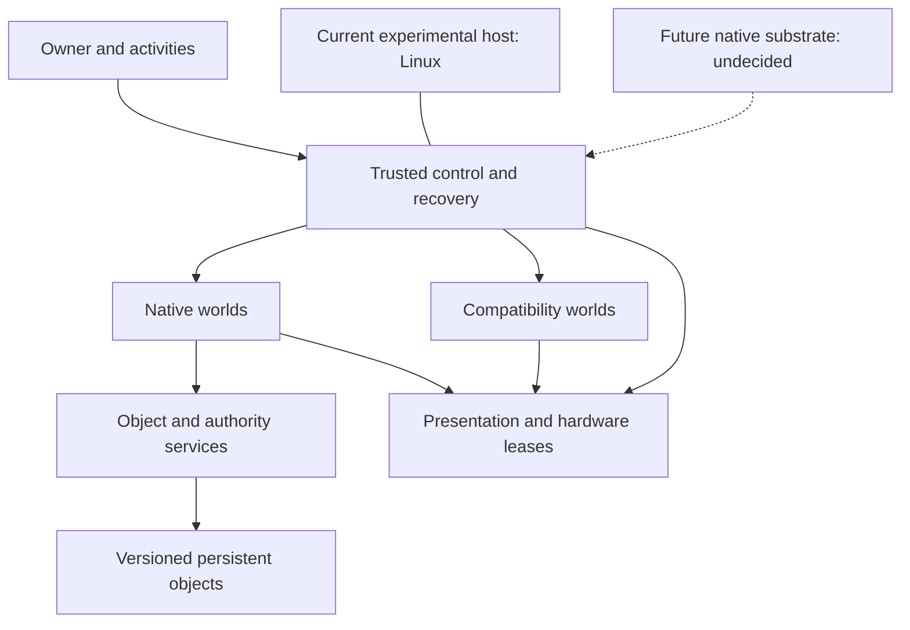

<!-- SPDX-License-Identifier: CC-BY-4.0 -->


# JANUS

JANUS is an experimental operating-system architecture for a personally owned
computer: applications and existing operating systems live in bounded **worlds**,
receive explicit authority, and contribute to activities the owner can leave,
resume and recover. The goal is a coherent personal system with dependable
boundaries—not universal trust in everything running under one account.

JANUS is research software, **not a production security system**. Its current
implementations run on Linux; the final native kernel and protection substrate
have not been selected. Start with the
[architecture whitepaper](docs/architecture/JANUS_Whitepaper_v0.1.md).

## Why JANUS exists

A computer can belong to one person while its programs remain mutually
untrusted. JANUS explores how to make that distinction visible: a program gets
the document or device access it needs, saved work survives a failed interface,
and the owner retains a recovery path independent of the foreground application.
Compatibility with existing operating systems is part of that design, alongside
native JANUS applications and services.

## Core ideas

- **Worlds** are execution and authority domains. Some may be native processes;
  others may contain a guest operating system. A world need not be a VM.
- **Activities** group the owner's work: objects, participating worlds and enough
  application state to reconstruct a useful session. They do not grant authority.
- **Explicit authority** separates knowing an object's identity from permission
  to use it. Grants constrain rights, recipients and delegation.
- **Persistent objects** have identity independent of their content revisions.
  Updates should publish complete revisions or fail without exposing partial work.
- **Hardware leases** describe controlled access, withdrawal, reset and quarantine.
  Closing a viewer is not evidence that a device is safe to reassign.
- **Compatibility worlds** host existing systems behind explicit boundaries
  instead of making their conventions the native JANUS interface.
- **Owner recovery** must remain available when a world or its presentation fails.
  Leaving presentation and stopping execution are distinct operations.

## Architecture

The diagram shows the intended organisation, not a claim that every layer exists.



The [contracts](docs/contracts/README.md) describe the intended boundaries.
Linux, libvirt and other host components remain part of the current trusted
computing base; hosted demonstrations do not establish native JANUS enforcement.

## Project status

Milestones follow whitepaper §14.2 and advance through review and evidence.

| Milestone | Status | Focus |
| --- | --- | --- |
| M0 — Contracts | Accepted | Reviewed experimental contracts and executable reference model |
| M1 — Hosted appliance | Accepted | UUID-bound guest control, presentation lifecycle and software recovery |
| M2 — Native experience | Current work | Native document tool, enforced object grants and activity reconstruction |
| M3 — Substrate experiment | Planned; not started | Evaluate a native capability substrate |
| M4 — Hardware ownership | Planned; not started | Device assignment, withdrawal, reset and quarantine |
| M5 — Personal alpha | Planned; not started | Daily-use activities, updates, backup and measured behaviour |

See [M0 acceptance](docs/evidence/m0-acceptance.md),
[M1 acceptance](docs/evidence/m1-acceptance.md) and the
[engineering roadmap](BOOTSTRAP_PLAN.md). Acceptance preserves the documented
experimental limitations; it does not freeze an ABI or storage format.

## What exists today

The C17 M0 reference model tests world, object, authority, foreground and device
semantics. The Linux-hosted M1 `janusd` broker and `janusctl` client implement
bounded owner operations against trusted libvirt UUID profiles. Live tests
showed that viewer loss, leaving presentation and broker restart preserve guest
execution, while recovery can withdraw an uncooperative viewer.

M1's test viewer packages were subsequently removed at the maintainer's request
to undo an unwanted package-provided USB-access policy. The recorded results
remain valid; new viewer tests require an approved dependency setup. M2 does not
require that viewer stack.

There is no native JANUS kernel, secure kiosk, physical recovery mechanism or
proven device/DMA isolation. Durable authority, anti-rollback and final public
interfaces remain open work. See the [decision register](docs/decisions/README.md).

## Building and testing

Development currently targets Debian 13 with GCC and Clang. Tests run unprivileged.

```sh
make check                    # repository integrity and helper checks
make test CC=gcc              # M0 reference model; repeat with CC=clang
make test-sanitize CC=gcc     # M0 ASan/UBSan; repeat with CC=clang
make hosted CC=gcc            # M1 broker/client; needs libvirt development files
make test-hosted CC=gcc       # M1 unit/process tests; no guest or viewer needed
make test-hosted-sanitize CC=gcc
```

Ordinary tests never create a VM. Consult [contributor setup](CONTRIBUTING.md)
and the [hosted M1 runbook](docs/development/HOSTED_M1.md) before any live test.

## Documentation

- [Architecture whitepaper](docs/architecture/JANUS_Whitepaper_v0.1.md)
- [Contracts](docs/contracts/README.md) and [requirements](docs/REQUIREMENTS.md)
- [Roadmap and milestone plan](BOOTSTRAP_PLAN.md)
- [Decisions](docs/decisions/README.md)
- [M1 evidence](docs/evidence/m1.md) and [boundary review](docs/evidence/m1-boundary-review.md)
- [Development conventions](docs/development/CODING.md), [host setup](docs/development/HOST.md)
  and [VM laboratory](docs/development/VM_LAB.md)

## Licensing

Independently authored JANUS software is ISC. Documentation and the whitepaper
are CC BY 4.0. Imported or derived material retains its applicable upstream terms.
See [licensing scope](LICENSING.md) and the [licence overview](LICENSE).

The JANUS name and logo, including `docs/JANUS_logo.png`, are excluded from those
grants. Rights are retained by Danyal A. Samak; no trademark licence or registration
is implied. See [branding policy](TRADEMARKS.md). The repository remains private;
licensing does not authorise a release or public announcement.

## Author

**Danyal A. Samak** — <dabsamak@tuta.com>

[cryogenix.org](https://www.cryogenix.org)
